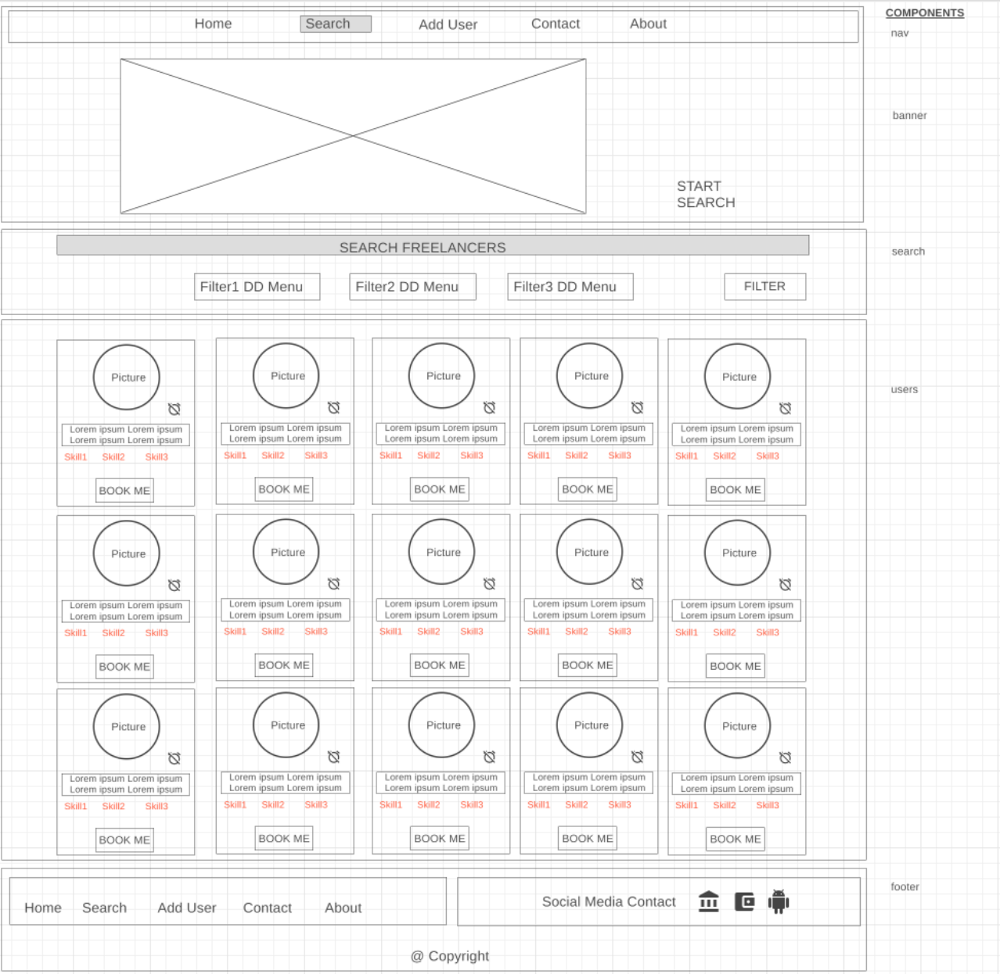
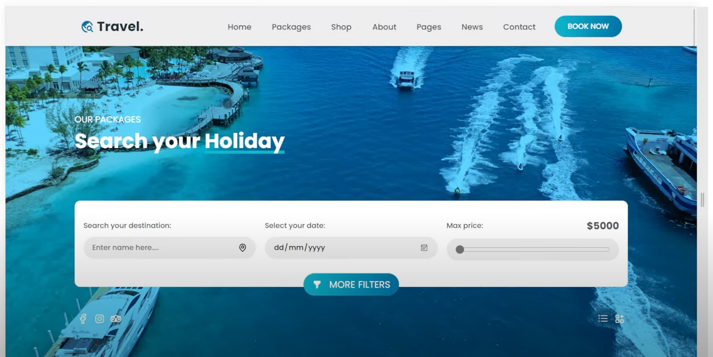
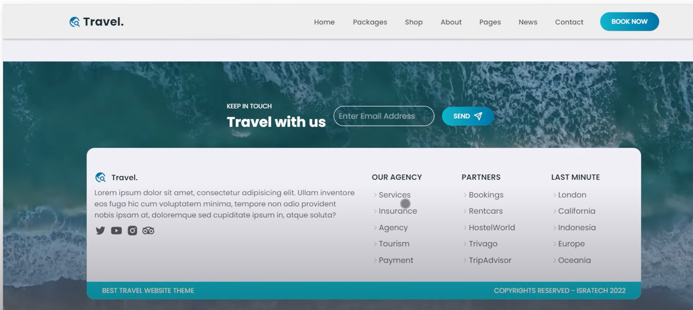

# Freelance Booking App

## Description
This Single Page Application is a user-friendly platform designed to facilitate the search and hiring of talented freelancers for various purposes, including personal projects, company migration, training opportunities, and collaborative work. To achieve this, we used the data from Random people generator website, which we adjusted slightly to fit our needs, and the images have been downloaded from https://unsplash.com/.

Users can easily browse and filter through a diverse range of freelancers by location, skills, and work type (e.g. full time, part time, contract), and can also check their availability and send enquiries via a simple form. With its powerful search capabilities, the website provides an efficient and streamlined way for individuals and businesses to find the right freelancers for their projects.

Built using React.js, Node, Tailwind, and Express, this website boasts an intuitive and user-friendly interface that ensures a seamless and enjoyable user experience. Moreover, freelancers can easily add themselves to the portfolio of available freelancers by filling out a basic form in the "Add User" section, enabling them to showcase their skills and expertise to potential clients.

Minimum viable product:
* Navigation bar
* About page
* Footer
* List of Freelancers as cards
* Ability to see availability of given Freelancers
* Ability to book Freelancers
* Ability to complete a form if a freelancers is unavailable


## Installation instructions
The following command will be needed to run the application. On both 'client' and 'server' folder use the following commands on Git

```
npm install
```
Then on the 'server' folder, run:
```
npm run dev
```
And finally on 'client' folder, run:
```
npm start
```
The website should preview on the default browser: localhost:3000

Frameworks used:


 


## Screenshot
Initial Wireframe design:


Colour and Style Inspiration:





### Desktop view:


### Mobile view:


## Link

To access github repository:
https://github.com/georgeboholteanu/Freelance-Booking-App


To access netlify deployed website:


## Credits

This project is a joint effort between:

George Boholteanu
GitHub link: https://github.com/georgeboholteanu

Andzej Streckul
GitHub link: https://github.com/Andzej-S

David Jolley
GitHub link: https://github.com/DavidHJolley

Tahmina Hannan
GitHub link: https://github.com/TahminaHannan

## License

Please refer to the LICENSE in the repo.